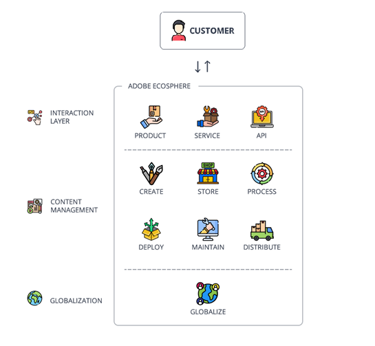
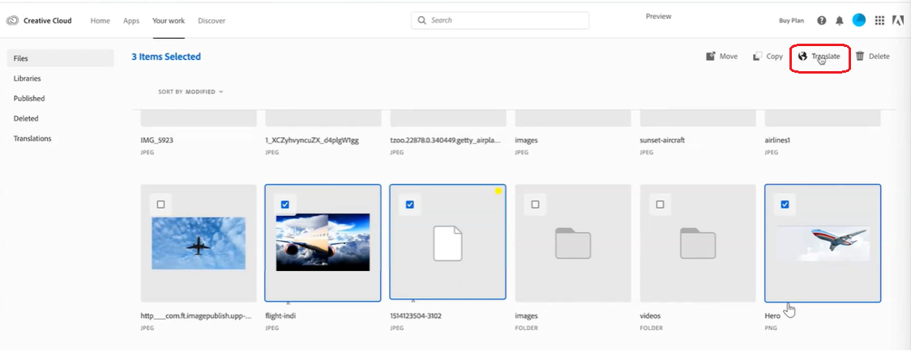

# Globalization Content Service: Overview

*Connecting content creators to translators together within the Adobe ecosphere and driving friction-less globalization workflows that reduce localization time and cost, improve planning and communication, and eliminate the need for translators to understand Adobe products and services just to extract source text and place translated text back in translation assets.* 

## Where does Globalization Content Service fit in Adobe’s content management lifecycle?
With Adobe products, individuals, SMBs, or large enterprises can create, process, deploy, maintain, distribute, analyze, store, and serve content. Adobe products across the three clouds-- Creative Cloud, Document Cloud and Experience Cloud—are designed to manage the entire spectrum of the content management lifecycle in customer’s native language. 

Globalization is the only missing component in the entire content management cycle. Currently, Adobe’s customers need to step out of the Adobe ecosystem and get content localized from third-party tools and companies. With Globalization Content Service, Adobe customers would get the complete content lifecycle management within the Adobe ecosphere.

Read on to understand the power and potential of Globalization Content Service in making customers successful and helping Adobe products become ubiquitous across regions. 

## Why do we need Globalization Content Service?
With Globalization Content Service, Adobe’s customers can do global readiness, translation readiness, ship their work across multiple languages at the same time, or set up rolling updates all by push of a button or a single-click from within Adobe products. 

The Globalization Content Service has benefits for all the four entities in the globalization ecosphere: Adobe, Adobe products, services and solutions, customer, and localization partner. 

### Adobe
With Globalization Content Service, Adobe is ready for **global content readiness**. Our customers can now produce content in any locale, and ship content across multiple locales. This ensures Adobe customers *need not move out of Adobe ecosphere for any content management task*. 

Content creation is an iterative work. With globalization as an inclusive part of the Adobe's content creation process, it's a lot easier to manage different locales, modify versions, evaluate, track, and approve translated tasks.

### Adobe Products, Services and Solutions
Adobe products now regard locales with the same status and quality as the native language in which the source content is created. Initiating, tracking, and reviewing and approving translations is now as easy as any other product feature. Globalization Content Service integration adds to the marketability, global readiness, and sustained use of Adobe products by content creators across multiple locales.

    

### Adobe Customers
All customers stay within the Adobe ecosphere both for the source and translated language. The localization process is a breeze. 

**Easy partner selection or onboarding**: Customers can quickly select a translation partner from Globalization Content Service pre-approved list of industry-leading localization partners. Further, customers can add their own existing or new localization partner in the Globalization Content Service and start working with them. 

The biggest advantages a customer gets is consistency and record-keeping. Globalization Content Service provides a **globalization system of record**, where the entire workflow and each task is being tracked. Offline file management, untraceable emails, notifications, and offline reminders are all gone. The customer can always access the status of any task. Since customers don’t have to manually track files for synchronization, productivity and quality is significantly enhanced.

With Globalization Content Service, the entire localization process is seamless, and communication is smoother and more structured. Customers experience **faster turnaround time** and save time, effort and costs in project management and IT operations. 

Finding a reputable, competent, and economical translation partner is difficult for an individual customer. **Finding a trustworthy partner** necessitates a lot of effort and, at times, costly failed attempts. Now, team and individual users don't have to look for translation partners outside of the Adobe ecosphere. Using Globalization Content Service, they can rely on reliable, high-quality translation services that they can afford.

### Translation Partners
**High-quality leveraging**: Use Adobe's pre-publishing and post-publishing workflows to automatically extract text from native Adobe formats, translate the text, and put it back in Adobe files in translated languages. Also, use the Globalization Content Service ecosphere to plan, scope and monitor work.

For example, Globalization Content Service can:

- Automatically extract text from different layers of Photoshop
- Hand it to localization partner 
- Localization partner translates it and then puts it back in Globalization Content Service
- Globalization Content Service creates new Photoshop files with translated content. 

With Globalization Content Service the localization process is consistent, the quality of translation is higher, and the time localization time and effort is lesser. Even more, the translation partners won’t have to invest in technology teams just for extracting, reading, interpreting, and previewing Adobe formats. Adobe does it for them. 

Localization partners can also **subscribe to events** and stay informed about all new and updated tasks. When the tasks are completed, their statuses are updated in the globalization system of record. Customers and Localization partners use the same system to track all activities. This optimizes communication, and program and project management.

For localization partners, Globalization Content Service opens up **new business and engagement opportunities**. Partners can expect a steady flow of business and the opportunity to interact with Adobe customers.

## Globalization Content Service Benefit Summary
The following table summarizes the benefits of Globalization Content Service.

| Stakeholder         | Benefits                                                                                              |
|---------------------|-------------------------------------------------------------------------------------------------------|
| **Adobe**               | • Changing the world through digital experiences across all languages and geos • Making everyone a creator, across regions, geos, and locales • Helping brands communicate in their language of choice from within the product or service ecosphere • Serve content across multiple geos, and languages at the push of a button |
| **Product**             | • Treat locales as first-class citizens within their repository. Treat English and all locales equal. • Customers can now translate any content in a one-click workflow • Easy translation synchronization • Fast onboarding and completion of localization tasks. |
| **Customer**            | • Stay within the ADOBE Ecosphere both for source and translated language • Easily manage the entire globalization process. Ease of handover with greater control. • Easy translation synchronization and fallback options. • Lesser churn, faster speed of localization, and better communication • Reduced cost of operation |
| **Translation Partner** | • Stay within the ADOBE Ecosphere for source and localized content • Use Globalization Content Service to automatically extract text from native ADOBE formats • Reduced or nil need to understand, decipher and transform ADOBE file formats. • Faster, better translation. Smoother communication. • Lesser overheads, lesser rework |

## Where do I find more information?

Follow these guides to work effectively with the Globalization Content Service:

* How to enable a partner to use the Globalization Content Service? 
    
    Follow this [guide](../partner/index.md) to onboard on the Adobe I/O console and access the Globalization Content Service APIs. 
    
* Where do I find the APIs available for a partner? Share syntax, examples, and response status for each API?

    Follow this [guide](../api/index.md) to find information about APIs available for partners.