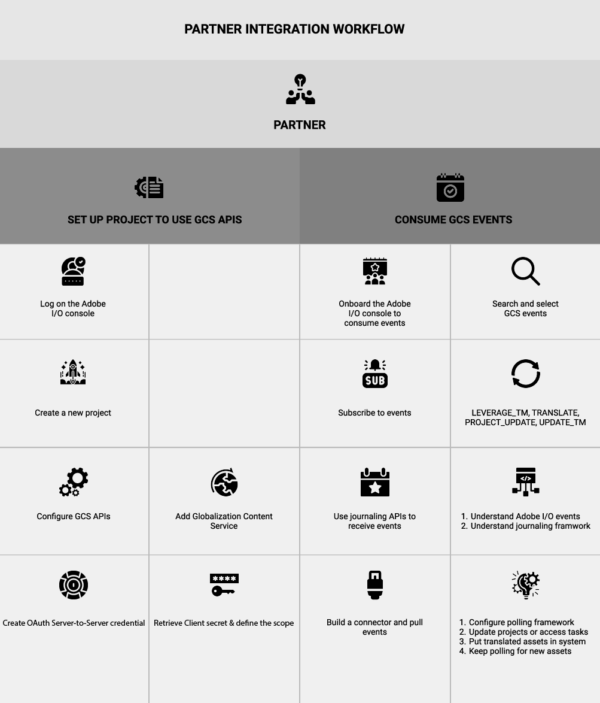
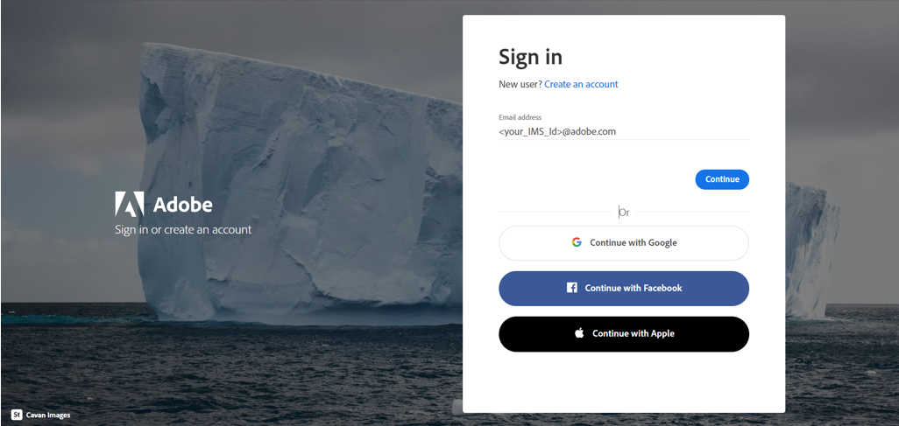
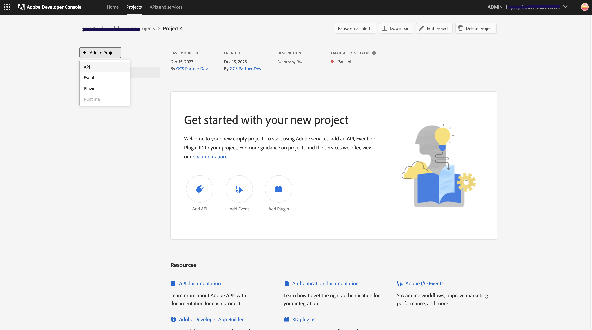
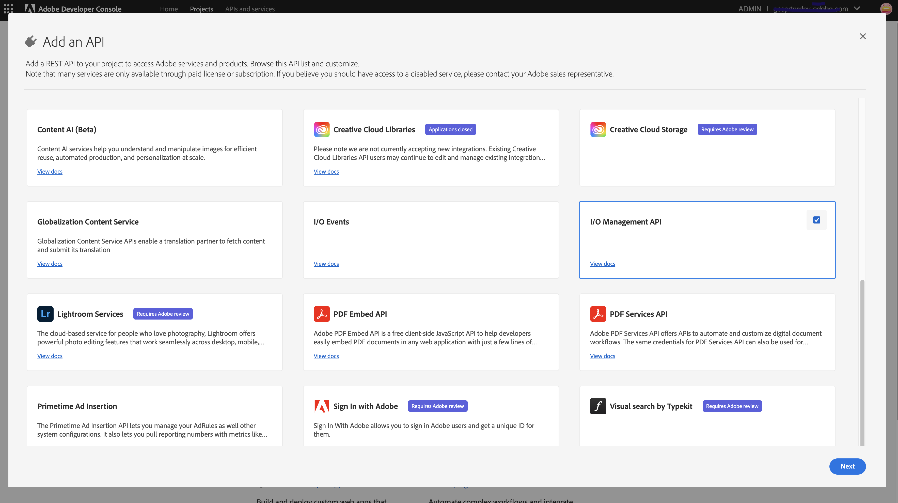
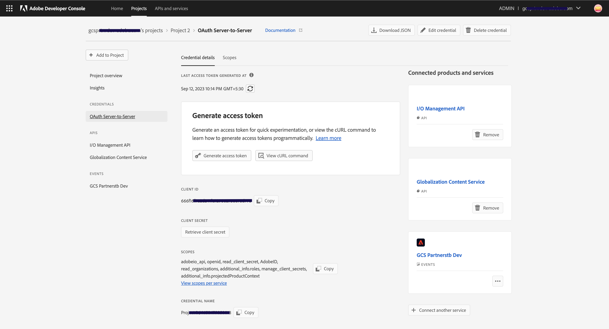
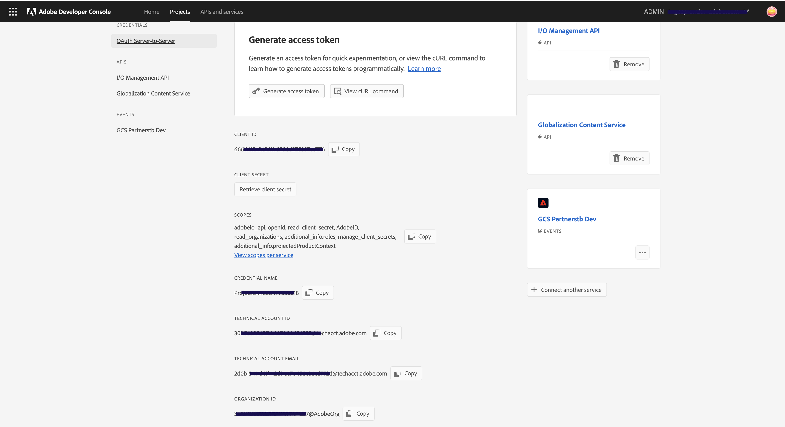
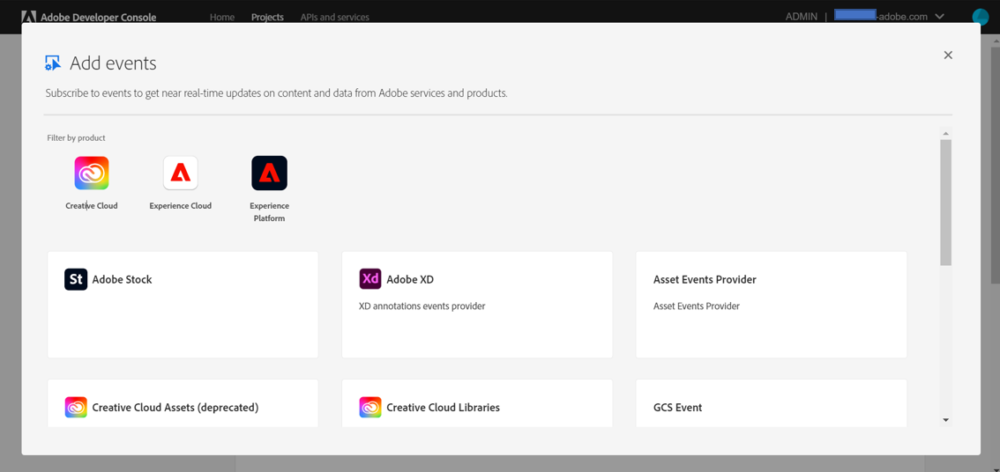
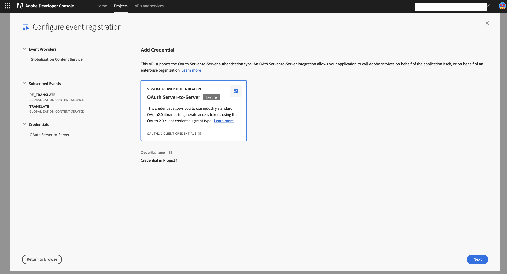
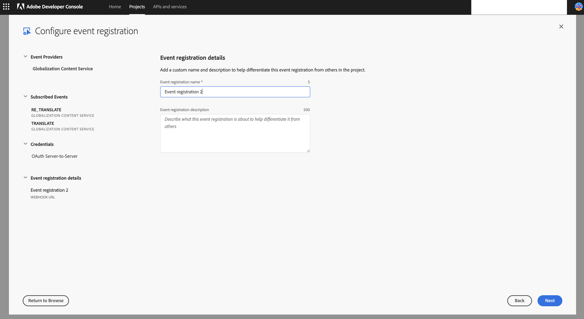

# Partner Connector Registration

1. [Overview](#overview)
2. [Glossary](#glossary)
3. [Partner Registration Process: High Level Overview](#partner-registration-process-high-level-overview)
4. [Partner Onboarding: The Complete Workflow](#partner-onboarding-the-complete-workflow)
5. [Build a Connector and Start Using Events and APIs](#build-a-connector-and-start-using-events-and-apis)
6. [Globalization Content Service Reference](#globalization-content-service-reference)

# Overview

The Globalization Content Service is a collection of services that let you extend and integrate localization workflows within Adobe apps and services. This document prepares localization partners to integrate Globalization Content Service into their environments.

From registering an organization, to setting projects, and enabling end-to-end localization workflows that includes sharing, retrieving, localizing, previewing assets, Globalization Content Service APIs let you perform all localization tasks while staying within the Adobe ecosphere.

# Glossary

In this guide, the following terms will be used.

| Glossary Term      | Definition                                                                                                                                                                                                                                   |
| ------------------ | -------------------------------------------------------------------------------------------------------------------------------------------------------------------------------------------------------------------------------------------- |
| **orgId**            | An enterprise that's using Adobe products and services for globalization workflows.|
| **tenantId**            |  The unique ID of the tenant within a customer org initiating localization workflows.|
| **tenantName**            |  The name of the tenant within a customer org in the format org-name (sandbox-name) e.g. "Test Org (TestSandbox name)". It's only for information purpose.|
| **serviceBaseUrl**            | This is the GCS service base url which the provider needs to call. For nld2 region customers, it'll be https://gcs-nld2.adobe.io and it'll be https://gcs.adobe.io otherwise. Provider service should use the value of serviceBaseUrl to get or complete GCS assets.|
| **IMS Token**      | An Identity Management System (IMS) token for the user in an organization that allows them to be authenticated by Adobe. These users can then use the services and products to which the org is entitled.                                    |
| **User**           | The end user in the Org who triggers the localization workflow. The user can trigger a task for localization, preview and approve a localized task.                                                                                          |
| **Partner**        | Localization partner that the Org wants to work with. Partner might have an offline selection with Adobe. Once the contracts are signed, partner is authorized into the Globalization Content Service through the Adobe I/O.                 |
| **Authentication** | The process of validating the IMS token and the IMS client id to verify if it has access to the Globalization Content Service.                                                                                                               |
| **Project**        | A project file is a list of unique properties that are used for managing the translation tasks. For example, a project can include the details of content system, locales, and providers.                                                    |
| **Task**           | A translation task is a group of translation assets which is being sent for translation as a unit. A task is sent to the partner in a XLIFF format for translation.                                                                          |
| **Event**          | An event is a notification on an action required at your end. Adobe partners can subscribe to Globalization Content Service events and get notifications when new assets are available for translation.                                      |
| **Webhook**        | Webhook is an Adobe I/O event. Your application can sign up to be notified whenever certain events occur. For example, when a user uploads an asset, an event is generated, which can be recorded by a webhook.                              |
| **Journaling**     | Journaling, in contrast to webhooks, is a pull model of consuming events, whereas webhooks are a push model. In journaling your application will issue a series of API calls to pull batches of one or more events from the journal.         |
| **Complete asset** | Complete Asset is an action taken by a partner service after manual translation has been completed. It starts a workflow to convert the translated Xliff into the localized asset in the source format and returns it to the content system. |
| **Normalization**  | Normalization is the process of converting an Adobe Asset into translation information in a XLIFF format.                                                                                                                                    |

# Partner Registration Process: High Level Overview

If your firm offers localization service, you may want to register with Adobe Globalization Content Service to provide your offerings to all Adobe users. Any enterprise that needs localization for content generated with Adobe tools can trigger a localization workflow from within Adobe products.

By registering with Adobe Globalization Content Service, you can reach out to new customers and avail deeper more integrated, optimized localization workflows for better planning, increased leveraging, and optimized communication. Also, you save significant time and effort in leveraging, previewing, and normalizing content from Adobe assets.

Interested to be a localization partner listed in the Globalization Content Service partner directory. Read on.

The following workflow diagram describes the steps in the partner registration process.



1. **Log on the Adobe I/O Console**: Create an account and log in Adobe I/O console. Once verified, you can access the products and services based on the permissions granted to you.
2. **Subscribe to APIs**: You can subscribe to the Adobe I/O Globalization Content Service APIs to manage projects, tasks, and assets.
3. **Subscribe to events**: Using Adobe I/O journaling APIs, subscribe to events and get near real-time communication. Even if you have thousands of tasks needing localization every week, the event journal will help you get info as soon as tasks are being triggered at the product end. Based on task information received in events, retrieve assets, localize them, preview quality, and send final translated assets back to the product through the Adobe I/O Globalization Content Service APIs.
4. **Create an OAuth Server-to-Server credential**: Add the new credential to your project to begin using the new credential to generate access tokens and update your application.

# Partner Onboarding: The Complete Workflow

Here's your guide to onboarding on the Adobe I/O console and accessing the Globalization Content Service APIs.

## Login

1. Log in to your Adobe I/O console account. Browse to the site [https://www.adobe.io/](https://www.adobe.io/) in your favourite browser.

   

2. Click **Console**.

3. Login using the IMS credentials you have received from the Globalization Content Service team.

   

## Create a Project and Configure Globalization Content Service APIs

1. Click **Create new project.**

   

2. Click **Add API** to associate APIs in your empty project.

   

3. Click **Adobe Services** to access Globalization Content Service APIs.

   

4. Click **Globalization Content Service**.

   

5. Click **Next**.

   

6. Enable API integration and select OAuth Server-to-Server.

   
   

7. Similar to the previous step, also add "I/O Management APIs" to your project.

   
8. Click **Next** & Add OAuth Server-to-Server authentication, then save configured API.

   

9. Generate OAuth Server-to-Server access token by clicking on to the CREDENTIALS section [ Redacted ]

   

    OAuth Server-to-Server credentials rely on the OAuth 2.0 client credentials grant. Therefore, you can use industry-standard OAuth 2.0 libraries to implement access token generation in your application.
    While OAuth Server-to-Server credentials do not use expiring certificates, they still allow client secret rotation through the UI and API.

    This credential does not use a public certificate and private key pair to generate access tokens. As an application developer, you do not have to periodically rotate the public certificates and private key pairs when they expire. Also, the credential setup process is greatly simplified, and you do not have to download and save the private key on your machine.

    Lastly, while the new OAuth Server-to-Server credentials do not use expiring certificates, they still allow client secret rotation through the UI and API.

    For more information please browse to the site [https://developer.adobe.com/developer-console/docs/guides/authentication/ServerToServerAuthentication/](https://developer.adobe.com/developer-console/docs/guides/authentication/ServerToServerAuthentication/)

10. Scroll down the screen and add to retrieve the client ID and client secret along with other information about the account.

    

11. The OAuth Server-to-Server Credential is generated. Feel free to copy the Generated OAuth or Sample Curl command.

## Onboard on to Adobe I/O Console to Consume Events

1. In the same project created above, we shall now add the events to be consumed.
2. Click on **+Add to Project.**.
3. Click on **Add Event.**

   

4. Click on the **Experience Platform.**

   

5. Select the **Globalization Content Service Event** and click **Next**.

   

6. The **Configure event registration** screen shows two events that you can subscribe.

   1. **TRANSLATE**: Used to trigger an event when a task is sent for localization.
   2. **RE TRANSLATE**: Used to trigger an event when asset is rejected sent back for localization.

   

7. Select the events you want to subscribe to and press **Next**.

   

8. You can choose the existing OAuth Server-to-Server for authentication and select Next.
   

9. The **Event registration details** form is displayed. Fill in the event details. You can change **Event registration name** and write a short description in the **Event registration description** box.

    

10. Notice that **Journaling** is selected in **How to receive events** section. Adobe's journaling APIs work as a ledger recording all events for a specified time. Developers like you can create your own configuration to access the Adobe Journaling APIs and access events.

    

11. Select **Save Configured events.**

    You get a message, "Your webhook is created successfully".

    Next, you see a summary screen where your journaling end point is confirmed.

    

    You can copy this end point and use at your end.

> The endpoint has the following URL structure:

```java
https://<events_on_ADOBE_io_path>/events/organizations/<unique_number>/integrations/<unique_number>/<unique_number>
```

12. After the configuration is done, partner needs to share the following information (in step 10 of [this section](#partner-onboarding-the-complete-workflow)) with the GCS Support Team <gcs-partners@adobe.com> :
     1. Technical Account Id
     2. Organization Id
     3. Provider name that they want to be displayed under "Providers" list in Adobe products
     4. Source locale if other than "en-US"
     5. List of locales (in BCP-47 format) that will be translated by partner
     6. URL of your service/company (optional)

# Build a Connector and Start Using Events and APIs

You have completed basic on-boarding preparation for Globalization Content Service. You can now build a connector at your end that will poll the Adobe I/O console indefinitely to pull events. Use the Adobe I/O Journaling APIs to consume and process events in bulk based on your need.

## Journaling APIs

The Adobe I/O Events Journaling API allows enterprise integration to consume and process events in bulk based on their own cadence. Every enterprise integration that is registered for events is enabled for journaling by default.

The journaling system functions as a ledger, storing all events. New entries (events) are added to the ledger, and the ledger continues to grow.

The enterprise that has registered for journaling receives near-real-time event notification. To gain access to the most recent events, the company can set up a continuous polling system. The journaling call functions similarly to a pull call. The first call retrieves events from the beginning of the serial number to the end of the last available data string. The next pull call can begin at the endpoint of the previous call and retrieve newer events. When iterated, the journaling process retrieves all events at the predefined pull frequency.

Bookmark these two pages for understanding how to use Adobe I/O events, Webhooks & journaling APIs

- Adobe I/O Events: [Adobe I/O Events Docs](https://www.adobe.io/apis/experienceplatform/events/docs.html)
- Webhooks Guide: [Introduction to Adobe I/O Events Webhooks](https://developer.adobe.com/events/docs/guides/)
- Journaling Guide: [Adobe I/O Events Journaling API](https://www.adobe.io/apis/experienceplatform/events/docs.html#!adobedocs/adobeio-events/master/api/journaling_api.md).

We recommend that you thoroughly research the Journaling APIs and create the connector that is best suited to your needs.

## Sample Connector

Here is a sample Journaling connector to help you understand the polling concepts. Some key parameters are highlighted and some data is redacted (XX). Note that you are free to create your connector in any way to achieve desired results.

```java
package com.adobe.ws.consumer.resource;

import java.io.IOException;
import org.apache.http.Consts;
import org.apache.http.Header;
import org.apache.http.HeaderElement;
import org.apache.http.HttpEntity;
import org.apache.http.HttpHeaders;
import org.apache.http.HttpStatus;
import org.apache.http.NameValuePair;
import org.apache.http.client.entity.EntityBuilder;
import org.apache.http.client.methods.CloseableHttpResponse;
import org.apache.http.client.methods.HttpGet;
import org.apache.http.client.methods.HttpPost;
import org.apache.http.entity.ContentType;
import org.apache.http.impl.client.CloseableHttpClient;
import org.apache.http.impl.client.HttpClientBuilder;
import org.apache.http.message.BasicNameValuePair;
import org.apache.http.util.EntityUtils;
import org.slf4j.Logger;
import org.slf4j.LoggerFactory;
import org.springframework.util.StringUtils;
import com.fasterxml.jackson.databind.JsonNode;
import com.fasterxml.jackson.databind.ObjectMapper;
import com.fasterxml.jackson.databind.node.ObjectNode;

public class SampleConsumer extends Thread {
  private static Logger = LoggerFactory.getLogger(SampleConsumer.class);
  private static final String KEY_BEARER = "Bearer ";
  private static final String KEY_X_API_KEY = "x-api-key";
  private static final String KEY_X_IMS_ORG_ID = "x-ims-org-id";
  private static final String KEY_LINK = "link";
  private static final String KEY_EVENTS = "events";
  private static final String KEY_EVENT = "event";
  private static final String KEY_BODY = "body";
  private static final String TASK_ID = "taskId";
  private static final String KEY_EVENT_CODE = "eventCode";
  private static final String KEY_CLIENT_ID = "client_id";
  private static final String KEY_CLIENT_SECRET = "client_secret";
  private static final String KEY_ACCESS_TOKEN = "access_token";
  private static final String SCOPE = "scope";
  private static final String GRANT_TYPE = "grant_type";
  private static final String KEY_REL = "rel";
  private static final String VAL_NEXT = "next";
  private static final String LEVERAGE_TM = "LEVERAGE_TM";
  private static final String UPDATE_TM = "UPDATE_TM";
  private static final String TRANSLATE = "TRANSLATE";
  private static final String PROJECT_UPDATE = "PROJECT_UPDATE";
  private static final String KEY_RETRY_AFTER = "retry-after";
  static String eventBaseUrl = "https://events-stage-va6.adobe.io/events/";
  static String eventFetchUrl =
      "organizations/XXXXX/integrations/XXXXX/864cXXXXXXXXXXXXXXXX080c?limit=1&latest=true";
  static String eventNextUrl =
      "organizations/XXXXX/integrations/XXXXX/864cc8d5-XXXXXXXXXXXXXXX0c?since=";
  static String eventClientId = "4bc0eXXXXXXXXXXXXXXX657a1";
  static String eventClientSecret = "<client_secret>";
  static String eventImsOrgId = "<your_id>@AdobeOrg";
  static String eventAccessToken = "SampleAccessToken";
  static int eventFetchInterval = 1000;
  static  String scopeValue = "adobeio_api,openid,read_client_secret,AdobeID,read_organizations,additional_info.roles,manage_client_secrets,additional_info.projectedProductContext";
  static  String grantType = "client_credentials";
  private static CloseableHttpClient imsClient = HttpClientBuilder.create().build();
  private CloseableHttpClient ioEventClient;
  private static ObjectMapper mapper = new ObjectMapper();

  public void run() {
    String ioEventUrl;
    String nextUrl = null;
    int count = 0;
    while (true) {
      if (StringUtils.isEmpty(nextUrl)) {
        ioEventUrl = eventBaseUrl + eventFetchUrl;
      } else {
        ioEventUrl = eventBaseUrl + nextUrl;
      }
      if (count % 1000 == 0) {
        logger.debug("Calling url = {}", ioEventUrl);
        count = 0;
      }
      count++;
      HttpGet httpGet = new HttpGet(ioEventUrl);
      httpGet.addHeader(HttpHeaders.AUTHORIZATION, KEY_BEARER + eventImsOrgId);
      httpGet.addHeader(KEY_X_API_KEY, eventClientId);
      httpGet.addHeader(KEY_X_IMS_ORG_ID, eventImsOrgId);
      Header[] linkHeaders = null;
      try (CloseableHttpResponse response = ioEventClient.execute(httpGet)) {
        int statusCode = response.getStatusLine().getStatusCode();
        linkHeaders = response.getHeaders(KEY_LINK);
        if (statusCode == HttpStatus.SC_OK) {
          HttpEntity entity = response.getEntity();
          if (entity != null) {
            String responseStr = EntityUtils.toString(entity);
            ObjectNode responseNode = mapper.readValue(responseStr, ObjectNode.class);
            logger.info(responseStr);
            Map<String, JsonNode> eventsByTaskId = parseEventsByTaskId(responseNode);
            for (Map.Entry<String, JsonNode> entry : eventsByTaskId.entrySet()) {
            String taskId = entry.getKey();
            JsonNode gcsMsgNode = entry.getValue();
            String eventCode = gcsMsgNode.get(KEY_EVENT_CODE).asText();
            String gcsMsg = mapper.writeValueAsString(gcsMsgNode);
            logger.info("EventCode: {}, Message consumed:{}", eventCode, gcsMsg);
            if (TRANSLATE.equalsIgnoreCase(eventCode)) {
              // Call translation api to make the task available to vendor
            } else if (RE_TRANSLATE.equalsIgnoreCase(eventCode)) {
              // Call re-translation api to make the task available to vendor
            }
              }
            nextUrl = getNextUrl(linkHeaders, nextUrl);
          }
        } else if (statusCode == HttpStatus.SC_NO_CONTENT) {
          Header retryHeader = response.getFirstHeader(KEY_RETRY_AFTER);
          if (retryHeader != null) {
            Thread.sleep(Long.parseLong(retryHeader.getValue()));
          }
          nextUrl = getNextUrl(linkHeaders, nextUrl);
        } else if (statusCode == HttpStatus.SC_UNAUTHORIZED) {
          eventAccessToken = getAccessToken(eventClientId, eventClientSecret);
          logger.debug("Access Token for event generated again successfully");
        } else {
          logger.error("{} \t {}", EntityUtils.toString(response.getEntity()),
              response.getStatusLine().getStatusCode());
        }
        Thread.sleep(eventFetchInterval);
      } catch (Exception e) {
        logger.error(e.getMessage(), e);
        nextUrl = getNextUrl(linkHeaders, nextUrl);
      }
    }
      }

  public static Map<String, JsonNode> parseEventsByTaskId(JsonNode responseNode) {
      Map<String, JsonNode> taskEventMap = new HashMap<>();

        JsonNode eventsArray = responseNode.get(KEY_EVENTS);
        if (eventsArray != null && eventsArray.isArray()) {
            for (JsonNode eventWrapper : eventsArray) {
                JsonNode event = eventWrapper.get(KEY_EVENT);
                if (event != null) {
                    JsonNode body = event.get(KEY_BODY);
                    if (body != null && body.has(TASK_ID)) {
                        String taskId = body.get(TASK_ID).asText();
                        taskEventMap.put(taskId, body);
                    }
                }
            }
        }
        return taskEventMap;
    }
  public static String getAccessToken(String clientId, String clientSecret)
      throws IOException {
    HttpPost httpPost = new HttpPost("https://ims-na1-stg1.adobelogin.com/ims/token/v3");
    httpPost.addHeader(HttpHeaders.CONTENT_TYPE, "application/x-www-form-urlencoded");
    HttpEntity requestEntity = EntityBuilder.create()
        .setContentType(ContentType.APPLICATION_FORM_URLENCODED.withCharset(Consts.UTF_8))
        .setParameters(
            new BasicNameValuePair(KEY_CLIENT_ID, clientId),
            new BasicNameValuePair(SCOPE, scopeValue),
            new BasicNameValuePair(KEY_CLIENT_SECRET, clientSecret),
            new BasicNameValuePair(GRANT_TYPE, grantType)
            )
        .build();
    httpPost.setEntity(requestEntity);
    try (CloseableHttpResponse response = imsClient.execute(httpPost)) {
      if (response.getStatusLine().getStatusCode() == 200) {
        HttpEntity responseEntity = response.getEntity();
        if (responseEntity != null) {
          String responseStr = EntityUtils.toString(response.getEntity());
          ObjectNode responseNode = mapper.readValue(responseStr, ObjectNode.class);
          return responseNode.get(KEY_ACCESS_TOKEN).asText();
        } else {
          throw new IOException("Empty response entity");
        }
      } else {
        throw new IOException(EntityUtils.toString(response.getEntity()));
      }
    }
  }

  private String getNextUrl(Header[] headers, String currentUrl) {
    for (Header : headers) {
      HeaderElement firstElement = header.getElements()[0];
      NameValuePair pair = firstElement.getParameterByName(KEY_REL);
      if (pair != null && VAL_NEXT.equals(pair.getValue())) {
        return eventNextUrl + firstElement.getValue().replace(">", "");
      }
    }
    return currentUrl;
  }
}
```

The key parameters in the code above are as follows:

| Calling the Journaling API                                                                                                                                                                                                                                                                           | Fetching events with Journaling API                                                                                                                                                                                                                                                                 |
| ---------------------------------------------------------------------------------------------------------------------------------------------------------------------------------------------------------------------------------------------------------------------------------------------------- | --------------------------------------------------------------------------------------------------------------------------------------------------------------------------------------------------------------------------------------------------------------------------------------------------- |
| 1. **eventClientSecret**: The Client_Secret key in the access token. <br/>2. **eventAccessToken**: The access token that you will use to access Journaling APIs. <br/>3. **eventIMSOrgId**: The IMS Org ID against which your org is authenticated into the Adobe I/O console. | 1. **eventBaseUrl**: The URL end point for calling the events. Eg, "https://events-stage-va6.adobe.io/events/" <br/>2. **eventFetchUrl**: The journaling end point that you get when you onboard on to Adobe I/O. <br/>3. **eventFetchInterval**: Define the interval to fetch the next event.<br/> |

> **Note**: To understand how you can use Adobe I/O events to build your own connector that calls the journaling APIs, see [Adobe I/O Events Journaling API.](https://www.adobe.io/apis/experienceplatform/events/docs.html#!adobedocs/adobeio-events/master/api/journaling_api.md)

Based on your operation, you can get the following response types.

1. **200 OK**: Successful operation and the list of events are added in the response body. To see a typical event, click [here](#event).

   Now use [Get Asset API](../api/index.md#get-all-assets-api) to fetch assets. Go ahead and localize them. Next, update the assets with [Put Asset API](../api/index.md#get-all-assets-api#update-asset-and-initiate-asset-complete-api).

1. **204 No Content**: No event is returned. You might have already reached the end of the journal. You will get a 200 OK response in a subsequent poll provided a new event is added in the journal at the client's end.

# Globalization Content Service Reference

## Event

A typical event with event code **TRANSLATE** will have the following information.

```java
 {
     "eventCode": "TRANSLATE",
     "tenantId": "906E3A095D....30A495FD6@AdobeOrg_AJO_prod",
     "tenantName": "<org-name> (<sandbox-name>)",
     "serviceBaseUrl": "https://gcs.adobe.io",
     "orgId": "906E3A095....230A495FD6@AdobeOrg",
     "projectId": "HT-Test1",
     "taskId": "HT_240717_1",
     "sourceLocale": "en-US",
     "translationProviderOrgId": "988120836....DE0A495C5D@AdobeOrg",
     "targetLocale": "ja-JP"
    }
```

A typical event with event code **RE_TRANSLATE** will have the following information.

```java

 {"eventCode": "RE_TRANSLATE",
 "tenantId": "745F37C35E4B....49421B@AdobeOrg_AJO_prod",
 "tenantName": "<org-name> (<sandbox-name>)",
 "serviceBaseUrl": "https://gcs.adobe.io",
 "orgId": "745F37C35E4B....49421B@AdobeOrg",
 "projectId": "7b8ed7e5-b25c-4694-90e3-92eaab8b76f4",
 "taskId": "HT_9f1954ac-c56c-489c-83b8-3e656a9b73e5",
 "sourceLocale": "en-US",
 "targetLocale": "fr-FR",
 "assetName": "email_body_from_ajo.html",
 "assetUrl": "https://<Storage Account Name>.blob.core.windows.net/gcsdev1/745F37C35E4B....49421B@AdobeOrg_AJO_prod/7b8ed7e5-b25c-4....3D&se=2024-05-03T23%3A49%3A13Z&sv=2019-02-02&sp=r&sr=b",
 "translationProviderOrgId": "5BD819C5....00A494114@AdobeOrg"}

```

Description of event fields:

- **eventCode**: Trigger an event when the following action occurs:
   - **Translate**: Send an asset for localization
   - **Re-Translate:**: Reject an asset locale and send it back for localization.

- **tenantId**: The unique ID of the tenant within a customer org initiating localization.
- **tenantName**: The name of the tenant within a customer org.
- **serviceBaseUrl**: GCS service base url which needs to be called i.e. https://gcs-nld2.adobe.io for nld2 region customers and https://gcs.adobe.io, by default.
- **orgId**: The unique ID of the customer's org.
- **projectId**: The unique id for the project under which tasks are created.
- **taskId**: The unique id for the translation task.
- **sourceLocale**: The source locale for the task.
- **targetLocale**: The locale in which translation has to be done.
- **assetName**: The name of the rejected asset.
- **assetUrl**: The individual URL of the rejected asset with reviewer's comments.
- **translationProviderOrgId**: The org id of the provider.

## Sample Acess Token

A sample access_token response from IMS is displayed below.

```java
{
    "access_token": "eyJhbGciOiJSUzI1NiIsIng1dSI6Imltc19uYTEtc3RnMS1rZXktYXQtMS5jZXIiLCJraWQiOiJpbXNfbmExLXN0ZzEta2V5LWF0LTEiLCJpdHQiOiJhdCJ9............-QcXfM9yYRzsBm9y8Zw91RbvieNU1MqxkYbCS-Lxx1YwvN73L7nrLR8_yZ5_2MKK_fm9VjhmViQHgsQ",
    "token_type": "bearer",
    "expires_in": 86399
}
```

## Where do I find more information?

Follow these guides to work effectively with the Globalization Content Service:

- Get an overview of the Globalization Content Service:
  Follow this [guide](../overview/index.md).
- Use Globalization Content Service APIs for partners:
  Follow this [guide](../api/index.md) to find information about APIs available for partners.
